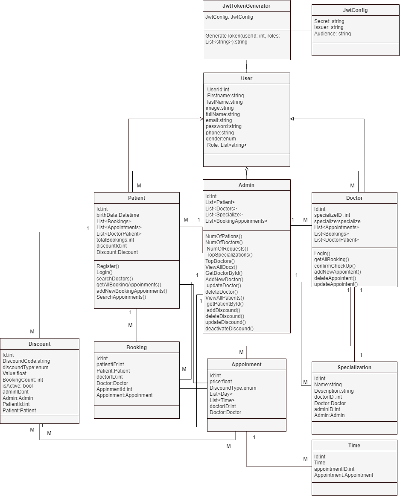

# Vezeeta API

A website dedicated to connecting patients with doctors for booking appointments. This project includes JWT authentication and other features.

## Project Documentation
[Google Drive Documentation](https://drive.google.com/drive/folders/1psZB5sGojt2SnHHa6DFZ1xf-kH4ZJuAT?usp=sharing)

[Google Drive Database Backup](https://drive.google.com/drive/folders/1b2hsGnQCbj9H5NL8Fm_WUjgLYlgbMyR7?usp=drive_link)

## Class Diagram

## How to Run the Project

### Steps

1. **Download the Code:**
   - Clone or download the project code from the repository.

2. **Open Project in Visual Studio:**
   - Open Visual Studio.
   - Use "File" -> "Open" -> "Project/Solution" to navigate to the root folder of your backend project and open the solution file.

3. **Set Startup Project:**
   - Right-click on the project that represents API  `Vezeeta.Presentation`.
   - Choose "Set as Startup Project."

4. **Run the Project:**
   - Press `F5` or click on the "Start Debugging" button to run the project. Alternatively, use `Ctrl + F5` to run without debugging.

